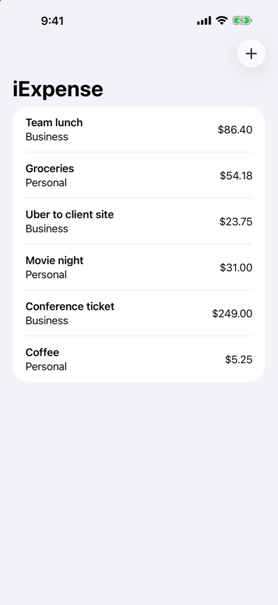
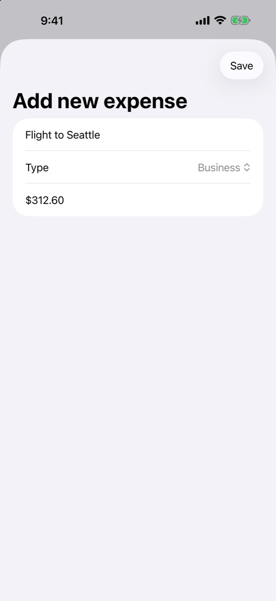

# iExpense

**Know where your money goes. Log personal and business spending in seconds, and it's still there next time you open the app.**

&nbsp;&nbsp;&nbsp;

---

## Why iExpense?

Expense tracking only works if it's faster than forgetting. iExpense keeps it to the essentials: a name, a type and an amount. Tap **+**, fill three fields, hit **Save**, and the expense lands in your list with proper currency formatting.

## Highlights

- **Fast entry.** A native form with a name field, a Business/Personal picker and a currency-formatted amount on the decimal keypad.
- **Personal vs. business.** Tag each expense so work costs never get mixed up with your weekend.
- **Swipe to delete.** Remove anything with the standard iOS swipe gesture.
- **Saved automatically.** Expenses are encoded to JSON and stored in `UserDefaults` on every change, so they survive app restarts. There's no save button to forget.

## Under the hood

- `ExpenseItem` is an `Identifiable`, `Codable` struct.
- `Expenses` is an `@Observable` class whose `didSet` persists the list and whose `init` restores it.
- `ContentView` shows a `List` with `onDelete` and presents `AddView` as a sheet from the toolbar's **+** button.

## Getting started

1. Clone the repo and open `iExpense.xcodeproj` in Xcode 15 or later.
2. Run on an iPhone simulator with **⌘R**.

## About

Built by **Roszhan Raj** as a SwiftUI learning project, inspired by Paul Hudson's *100 Days of SwiftUI*.
